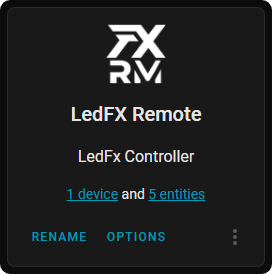
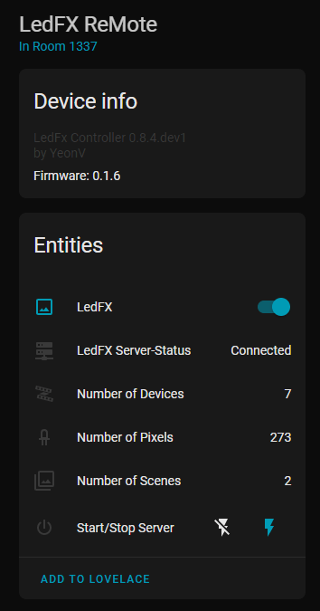
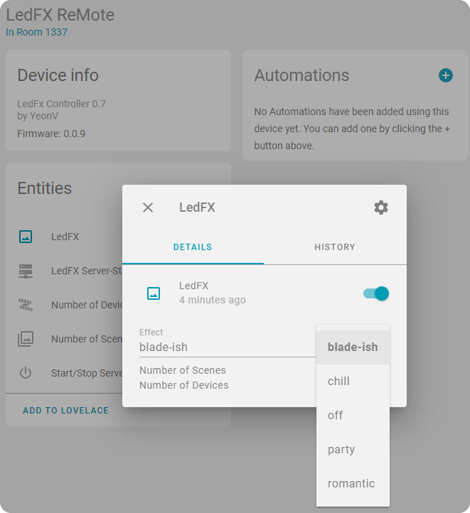

# LedFX ReMote for HomeAssistant

 
 
 
 
 
 

---

### [Custom Integration](https://github.com/hacs/integration) for [Home Assistant](https://github.com/home-assistant) to control a any (local/remote) [LedFX-server](https://github.com/ahodges9/LedFx)
---

# Features

- Everything configurable via UI
- AutoConnect to 3 LedFX-Rest-API-Endpoints
- Automatically `GET` Informations from all Endpoints
- AutoCreate Entities:
  - Binary Sensor (Is LedFX online?)
  - Devices Sensor (Number of Devices inside LedFX)
  - Scenes Sensor (Number of Scenes inside LedFX)
  - Switch (Upcoming feature! only logging functionality atm)
  - Light 
    - EffectList (Filled with scenes from LedFX)
    - On/Off mirrors Switch - upcoming feature
- EffectList-Change will fire LedFX via `PUT`

# Upcoming Features

- Implement Server Start/Stop Commands
- Make also use of the after setup config flow (options)
  - Allow editing of setup-settings
  - Make SCAN_INTERVAL editable via UI
  - Allow disable poll (If you have everything setup in ledfx, there is no need to poll for new infos all the time)
  - Create a Sync-Button to manually trigger a request
  - Add more `POST` and `PUT` calls

# Requirements:

- [LedFX](https://github.com/ahodges9/LedFx) with at least one scene setup
- [hass](https://github.com/home-assistant) - (HomeAssistant)
- [HACS](https://hacs.xyz/) - (HomeAssistantCommunityStore)

# QuickStart

- Install via Hacs
- Goto Hass-Config-Integration -> Add -> Ledfx Remote
- Fill Ip & port (LedFX Server needs to online)
  - no changes in configuration.yaml needed 
  - all Settings are handled via UI
- Open the light entity and change your scenes :)

# [Step by Step - Images-Guide](https://github.com/YeonV/ledfxrm/wiki/Step-by-Step-Images)

# Screens

# Credits

# Special Thanks

