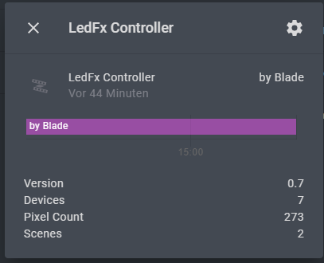
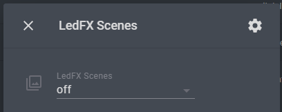

# LedFX Remote for HomeAssistant

A proof of concept, for controlling a remote [ledfx-server](https://github.com/ahodges9/LedFx) via [Home Assistant](https://github.com/home-assistant)

### How to

- copy this folder inside custom_compontents
- at the moment a lot of manual work is needed:
  - add `ledfxrm:` to your configuration.yml
  - edit this __init__.py and change your IP
  - inside this file there are comment-snippets
  - create the rest_command, input_select and automation as showed in those snippets
  - sent a MQTT message to `blade/ledfx/info` to trigger the sync  
  
Refactoring this sh.t asap

### What does it do?

When the sync runs, 3 API-endpoints of ledfx are fetched: info, devices, scenes
A Summary-Entity is created with those infos:

A picklist is created/upadted and filled with the scenes

=> changing the dropdown will activate the selected scene.

